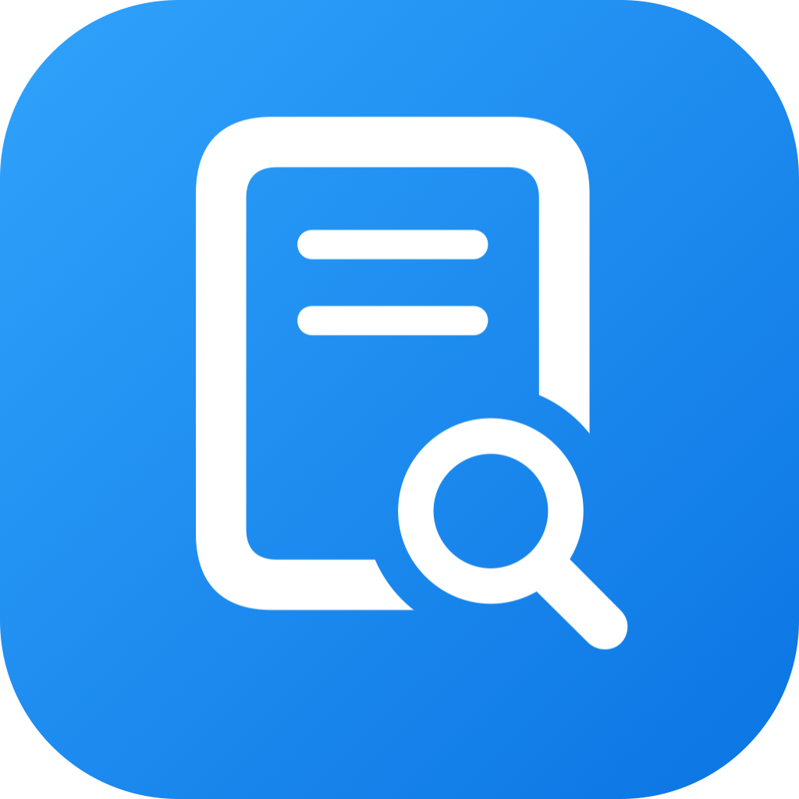
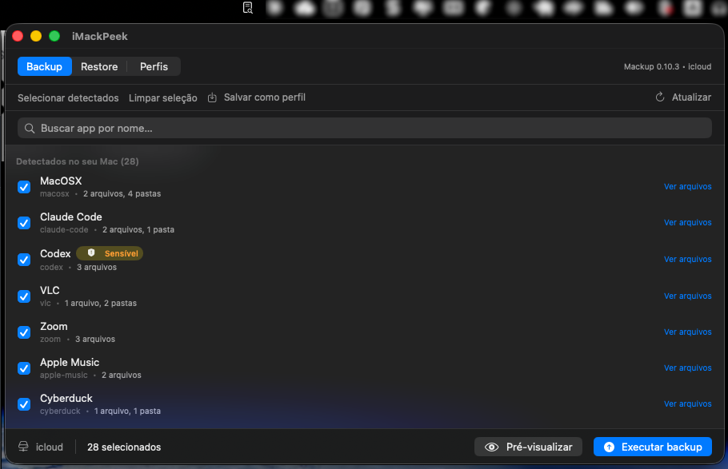

<div align="center">
  

  <h1>iMackPeek</h1>

  <p><strong>Uma interface visual pro <a href="https://github.com/lra/mackup">Mackup</a> — backup e restore das configurações dos seus apps no macOS.</strong></p>
  <p>Veja quais apps têm config no seu Mac, marque o que quer salvar e mande backup ou restore. Sem decorar comando, sem editar <code>.cfg</code> na mão.</p>

  <p>
    
    
    
    
  </p>
</div>

---

<p align="center">
  
</p>

---

## 🧭 O problema

O [Mackup](https://github.com/lra/mackup) é ótimo pra versionar as configurações dos seus apps (dotfiles, prefs, `.gitconfig`, settings do VS Code…) e sincronizá-las via iCloud, Dropbox ou disco. Mas é **CLI-only desde 2013** — a [issue pedindo uma GUI (#604)](https://github.com/lra/mackup/issues/604) está aberta sem implementação. Pra usar, você decora `mackup backup`, `mackup restore`, edita um `.mackup.cfg` na mão pra escolher o que sincronizar, e torce pra não estar mandando o `.ssh/` inteiro pra nuvem sem perceber.

## ✨ A solução

iMackPeek é um app de barra de menu que **envelopa o `mackup` instalado** e mostra, numa tela só, quais dos 600+ apps suportados realmente têm arquivos de config no seu Mac. Você marca o que quer, **pré-visualiza** (dry-run) e executa **backup** ou **restore** — tudo com checkbox e botão. Não é um fork nem reimplementação: por baixo é o `mackup` de verdade, com a saída dele lida e apresentada de forma legível.

E o mais importante: **nunca toca no seu `~/.mackup.cfg`**. Cada ação gera um `.cfg` temporário e descartável, preservando qualquer configuração manual que você já tenha.

## 🎯 Features

- 🔍 **Detecção automática** — escaneia os 600+ apps suportados e separa "detectados no seu Mac" dos "suportados mas ausentes"
- ✅ **Seleção por checkbox** — marque app por app o que entra no backup/restore, veja os arquivos de cada um antes
- 👀 **Pré-visualização (dry-run)** — roda `mackup -n` e mostra exatamente o que aconteceria, sem mexer em nada
- ⚠️ **Aviso de paths sensíveis** — badge amarelo em apps cujo backup inclui `.ssh/`, `.aws/`, `.gnupg/`, `.kube/`, credenciais etc., pra você não mandar segredo pra nuvem sem querer
- ♻️ **Modo Restore** — lista o que está no storage (iCloud/Dropbox/disco), com data de cada backup, e restaura com um clique
- 💾 **Perfis salvos** — guarde seleções nomeadas ("Setup dev", "Sistema apenas") e dispare backup/restore direto do menu
- 🔄 **Reiniciar daemons pós-restore** — toggle pra dar `killall cfprefsd Finder Dock` e fazer o macOS reler as prefs restauradas
- 📦 **Instalação assistida do Mackup** — se o `mackup` não estiver instalado, o app detecta e oferece instalar via Homebrew
- 🪶 **Discreto** — vive só na barra de menu, sem ícone no Dock

## 📦 Instalação

1. Baixe o `.dmg` da página de [Releases](https://github.com/fredwilliamtjr/iMackPeek/releases)
2. Monte o DMG e arraste o `iMackPeek.app` pra pasta **Applications**
3. Primeira abertura: clique com **botão direito → Abrir** (o Gatekeeper reclama porque o app não é assinado com Developer ID)
4. Se o macOS insistir que "o app está danificado":
   ```bash
   xattr -dr com.apple.quarantine /Applications/iMackPeek.app
   ```

> **Pré-requisito:** o iMackPeek envelopa o [Mackup](https://github.com/lra/mackup). Se ele não estiver instalado (`brew install mackup`), o app detecta e oferece instalar pra você.

> **Acesso Total ao Disco:** o scan precisa ler as configs de outros apps em `~/Library/...`. Na primeira vez o macOS pede permissão. Pra parar de perguntar, conceda **Acesso Total ao Disco** ao iMackPeek em **Ajustes do Sistema → Privacidade e Segurança → Acesso Total ao Disco**.

## ⚙️ Como usar

1. Clique no ícone da barra de menu e abra a janela
2. Em **Backup**, o app lista os apps com config detectada — marque os que quer salvar (clique em "Ver arquivos" pra inspecionar cada um)
3. Clique em **Pré-visualizar** pra ver o dry-run, depois em **Executar backup**
4. Em **Restore**, o app lista o que já está no seu storage — marque e restaure (ligue o toggle de reiniciar daemons se mexeu em prefs do sistema)
5. Salve uma seleção como **perfil** pra repetir depois com um clique

> A barra superior mostra o **storage engine ativo** (iCloud, Dropbox, disco…), lido do seu `~/.mackup.cfg` real. O iMackPeek nunca reescreve esse arquivo — usa um `.cfg` temporário a cada ação.

## 🧱 Arquitetura

```
iMackPeek/
├── App/                  # @main, AppDelegate (menu bar, agent policy), Info.plist
├── Core/                 # Wrapper do mackup, parser, detecção de apps, config, perfis, storage
├── UI/                   # Janela principal, modos Backup/Restore, Perfis, componentes
├── Utilities/            # Shell, detecção do Homebrew, logger, launcher de terminal
└── Resources/            # Assets (ícone) + known-sensitive-paths.json
```

| Componente | Responsabilidade |
|---|---|
| `MackupCLI` | Wrapper de `Process` pra chamar o binário `mackup` (`list`, `show`, `backup`, `restore`) com `-c <cfg>` e `-f`/`-n` |
| `MackupParser` | Faz o parse da saída de `mackup list` (600+ slugs) e `mackup show <app>` (paths monitorados) |
| `ApplicationDetector` | Cruza os paths de cada app com `FileManager` pra ver o que realmente existe no Mac |
| `ConfigGenerator` | Gera o `.cfg` temporário em `~/.imackpeek-<UUID>.cfg` (precisa estar no home) e o remove após uso |
| `StorageInspector` | Lê a pasta de storage (iCloud/Dropbox/disco) conforme o `[storage]` do `.mackup.cfg` pro modo restore |
| `SensitivePathChecker` | Marca apps cujo backup toca paths de `known-sensitive-paths.json` |
| `ProfileStore` | Persiste perfis nomeados em `~/Library/Application Support/iMackPeek/profiles/` |
| `ShowCache` | Cacheia `mackup show` em `~/Library/Caches/iMackPeek/show-cache.json` (TTL 24h) pra acelerar o 2º scan |
| `HomebrewDetector` | Localiza o `mackup` em `/opt/homebrew/bin`, `/usr/local/bin` ou `/usr/bin` |
| `LaunchAtLogin` | Toggle de início automático via `SMAppService.mainApp` |

## 🔨 Build a partir do código

Requisitos:
- macOS 13.0+
- Xcode 15+
- Swift 5.0
- [`xcodegen`](https://github.com/yonaskolb/XcodeGen) (`brew install xcodegen`)
- [`mackup`](https://github.com/lra/mackup) em runtime (`brew install mackup`)

```bash
git clone https://github.com/fredwilliamtjr/iMackPeek.git
cd iMackPeek
xcodegen generate          # o .xcodeproj não é versionado — é gerado do project.yml
open iMackPeek.xcodeproj
```

Ou via linha de comando:

```bash
xcodebuild -project iMackPeek.xcodeproj -scheme iMackPeek -configuration Release \
    -destination 'platform=macOS' build
```

### Gerar um DMG distribuível

```bash
./scripts/build_release.sh   # compila Release e copia pra dist/iMackPeek.app
./scripts/create_dmg.sh      # monta dist/iMackPeek.dmg com layout "arraste pra Applications"
```

### Regerar o ícone do app

```bash
swift scripts/generate_icon.swift Resources/Assets.xcassets/AppIcon.appiconset/ azul
```

## 🔒 Segurança / sandboxing

- **App Sandbox**: desligado. Necessário pra invocar o binário `mackup` via `Process` — incompatível com o sandbox.
- **Acesso a arquivos**: o iMackPeek só **lê** pra detectar config de apps e inspecionar o storage. As alterações de fato são feitas pelo `mackup`, não pelo app.
- **Nunca escreve no seu `~/.mackup.cfg`** — sempre gera um `.cfg` temporário e descartável por ação.
- **Aviso de paths sensíveis** — chama atenção quando um backup inclui credenciais (`.ssh/`, `.aws/`, etc.) antes de mandá-las pro storage.
- **Assinatura**: ad-hoc por padrão. Pra distribuição sem fricção de Gatekeeper, precisaria de Developer ID + notarização da Apple.

## 🚫 Limitações conhecidas

- **Só copy mode.** O link mode do Mackup está quebrado no Sonoma+; o iMackPeek usa exclusivamente copy mode (o default de `backup`/`restore`) e não expõe link mode na UI.
- **iCloud Drive com placeholders.** Arquivos ainda não baixados aparecem como placeholder; pode ser necessário baixá-los antes de um restore completo.
- **Não existe `mackup uninstall` em copy mode (0.10.3).** Pra "limpar" um backup, deleta-se a pasta do storage manualmente.
- **A saída do `mackup` pode mudar entre versões.** O parser é tolerante, mas confia no `--help` da versão instalada, não na doc do master.

## 🗺️ Roadmap

- [x] Wrapper do `mackup` (`list`/`show`/`backup`/`restore`) + parser tolerante
- [x] Modo Backup com detecção de apps e dry-run
- [x] Modo Restore lendo o storage
- [x] Aviso de paths sensíveis
- [x] Perfis salvos + atalhos no menu bar
- [x] Cache de `mackup show`
- [x] Instalação assistida do Mackup
- [x] DMG distribuível
- [ ] Developer ID + notarização (distribuir sem aviso do Gatekeeper)
- [ ] Botão "Limpar storage" com confirmação dupla
- [ ] Diff entre o que está no Mac e o que está no backup
- [ ] Localização em inglês

## 👨‍👩‍👧 Família Peek

iMackPeek é o terceiro app da família **Peek** — utilitários de barra de menu que "espiam" partes do macOS que o sistema esconde:

- [**iCloudPeek**](https://github.com/fredwilliamtjr/iCloudPeek) — o que o iCloud Drive está subindo/baixando em tempo real
- [**iNetPeek**](https://github.com/fredwilliamtjr/iNetPeek) — failover automático entre Ethernet e Wi-Fi
- **iMackPeek** — backup/restore das configs dos seus apps via Mackup

## 📄 Licença

TBD

---

<div align="center">
  <sub>Feito com ☕ por <a href="https://github.com/fredwilliamtjr">@fredwilliamtjr</a></sub>
</div>
