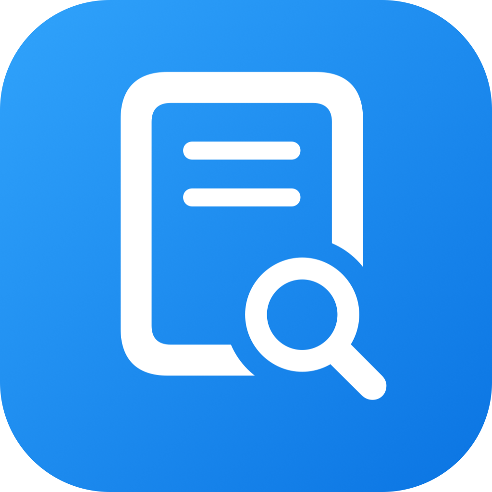
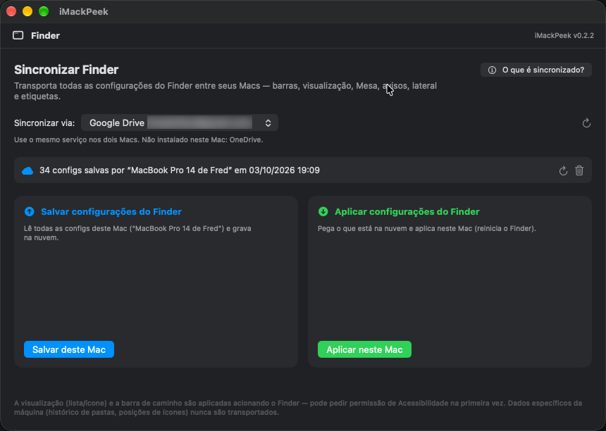

<div align="center">
  

  <h1>iMackPeek</h1>

  <p><strong>Leve as configurações do Finder de um Mac para o outro — pelo iCloud Drive, Google Drive ou OneDrive.</strong></p>
  <p>Ajustou o Finder do jeito que gosta num Mac? Clique em <em>Salvar</em> nele e em <em>Aplicar</em> no outro. Barras, visualização, Mesa, avisos, barra lateral e etiquetas chegam iguais.</p>

  <p>
    
    
    
    
  </p>
</div>

---

<p align="center">
  
</p>

---

## 🧭 O problema

O macOS não sincroniza as preferências do Finder entre Macs. Cada máquina nova (ou formatada) começa com barra de caminho escondida, extensões ocultas, visualização em ícones, avisos ligados… e você refaz tudo à mão. Copiar o `com.apple.finder.plist` inteiro também não serve: ele carrega lixo da máquina de origem (histórico de pastas, caminhos `/Users/<você>/…`, posições de janelas e ícones, IDs de conta) que bagunça a outra máquina.

## ✨ A solução

iMackPeek é um app de barra de menus que lê **só as chaves portáveis** das preferências do Finder, grava num arquivo dentro da pasta do seu serviço de nuvem e, no outro Mac, aplica essas chaves e faz o Finder relê-las — inclusive as barras da janela aberta, que o macOS não recarrega sozinho.

## 🎯 Features

- ☁️ **Escolha o serviço de nuvem** — iCloud Drive, Google Drive ou OneDrive. O app detecta quais estão instalados no Mac (e cada conta do Google Drive/OneDrive vira uma opção)
- ⬆️ **Salvar deste Mac** — captura cerca de 50 configurações do Finder e grava em `iMackPeek/finder-settings.plist` no serviço escolhido
- ⬇️ **Aplicar neste Mac** — grava as configurações, reinicia Finder/WindowManager e aciona as barras (caminho, status, lateral, abas) na janela viva
- ℹ️ **"O que é sincronizado?"** — informativo, por grupo, de tudo que viaja entre os Macs (e do que fica de fora de propósito)
- 🗑️ **Excluir sincronização** — apaga o arquivo salvo na nuvem, com confirmação; não mexe nas configurações locais
- 🪶 **Discreto** — vive na barra de menus; o ícone só aparece no Dock enquanto a janela está aberta
- 🚀 **Iniciar com o macOS** — opcional, pelo menu da barra

### O que é sincronizado

| Grupo | Exemplos |
|---|---|
| Barras e visualização | estilo de visualização padrão; barras de caminho, status, lateral e abas; botões da barra de ferramentas |
| Mesa | discos internos/externos, mídia removível e servidores na Mesa; ocultar ícones da Mesa; pastas no topo |
| Janelas e navegação | pasta de nova janela, abrir em abas, pastas com mola e atraso |
| Avançado | arquivos ocultos, todas as extensões, avisos (extensão, iCloud, lixo), lixo após 30 dias, escopo da busca |
| Opções de visualização | tamanho de ícone, grade, colunas, agrupamento (Mesa, janelas, Lixo, Rede, iCloud, pacotes) |
| Barra lateral e etiquetas | largura, seções abertas/fechadas, etiquetas favoritas e recentes |
| Rede | servidores salvos e recentes em "Conectar ao servidor" |

**Não viaja (de propósito):** histórico de pastas, posições de ícones e janelas, IDs de conta iCloud e flags de migração.

## 📦 Instalação

1. Baixe o `.dmg` da página de [Releases](https://github.com/fredwilliamtjr/iMackPeek/releases)
2. Monte o DMG e arraste o `iMackPeek.app` pra pasta **Applications**
3. Primeira abertura: clique com **botão direito → Abrir** (o Gatekeeper reclama porque o app não é assinado com Developer ID)
4. Se o macOS insistir que "o app está danificado":
   ```bash
   xattr -dr com.apple.quarantine /Applications/iMackPeek.app
   ```

> **Permissões:** para o *Aplicar*, conceda ao iMackPeek **Acessibilidade** (acionar as barras de caminho, lateral e abas pelo menu do Finder) e **Acesso Total ao Disco**, em **Ajustes do Sistema → Privacidade e Segurança**. Ao usar Google Drive ou OneDrive pela primeira vez, o macOS pode pedir permissão para o app acessar a pasta do serviço.

## ⚙️ Como usar

1. Clique no ícone da barra de menus → **Abrir iMackPeek**
2. Em **Sincronizar via**, escolha o serviço de nuvem — **o mesmo nos dois Macs**
3. No Mac de origem, clique em **Salvar deste Mac**
4. No Mac de destino, espere o serviço de nuvem baixar o arquivo e clique em **Aplicar neste Mac**

> A escolha do serviço é guardada em cada Mac. Se o serviço escolhido for desinstalado, o app **não troca sozinho** de serviço: avisa e grava só localmente até você escolher outro.

### Onde o arquivo fica

| Serviço | Pasta |
|---|---|
| iCloud Drive | `~/Library/Mobile Documents/com~apple~CloudDocs/iMackPeek/` |
| Google Drive | `~/Library/CloudStorage/GoogleDrive-<conta>/Meu Drive/iMackPeek/` |
| OneDrive | `~/Library/CloudStorage/OneDrive-<conta>/iMackPeek/` (ou `~/OneDrive/iMackPeek/` no cliente antigo) |
| Nenhum disponível | `~/Library/Application Support/iMackPeek/` (local — não sincroniza) |

## 🧱 Arquitetura

```
iMackPeek/
├── App/                  # @main (MenuBarExtra), AppDelegate, AppModel, WindowManager, Info.plist
├── Core/                 # Nuvem, receita/captura/aplicação das prefs, AppleScript do Finder, Dock, login
├── UI/                   # Janela principal (abas) e aba Finder, componentes
├── Utilities/            # Shell (Process), logger
└── Resources/            # Assets (ícone)
```

| Componente | Responsabilidade |
|---|---|
| `CloudStorage` | Detecta iCloud Drive / Google Drive / OneDrive, guarda a escolha do Mac e resolve a pasta de armazenamento |
| `SystemPrefsCatalog` | Receita com as chaves portáveis do Finder (e o texto do informativo) |
| `SystemPrefsSync` | Captura e aplica as chaves via `CFPreferences`; lê/grava/exclui o `finder-settings.plist` |
| `FinderUIApplier` | AppleScript que aciona as barras na janela viva do Finder (System Events para caminho/lateral/abas) |
| `FinderSyncViewModel` | Orquestra salvar, aplicar (incl. `killall` de `cfprefsd`, Finder e WindowManager) e excluir |
| `WindowManager` / `DockPresence` | Janela criada sob demanda (início silencioso) e ícone no Dock só com a janela aberta |
| `LaunchAtLogin` | Toggle de início automático via `SMAppService.mainApp` |

O app é organizado em **abas de sincronização** (`AppMode`); a primeira é o Finder, e novas abas entram como novas receitas em `SystemPrefsCatalog`.

## 🔨 Build a partir do código

Requisitos:
- macOS 13.0+
- Xcode 15+
- Swift 5.0
- [`xcodegen`](https://github.com/yonaskolb/XcodeGen) (`brew install xcodegen`)

```bash
git clone https://github.com/fredwilliamtjr/iMackPeek.git
cd iMackPeek
xcodegen generate          # o .xcodeproj não é versionado — é gerado do project.yml
open iMackPeek.xcodeproj
```

Ou via linha de comando:

```bash
xcodebuild -project iMackPeek.xcodeproj -scheme iMackPeek -configuration Release \
    -destination 'platform=macOS' build
```

### Gerar um DMG distribuível

```bash
./scripts/build_release.sh   # compila Release universal e copia pra dist/iMackPeek.app
./scripts/create_dmg.sh      # monta dist/iMackPeek.dmg com layout "arraste pra Applications"
```

### Regerar o ícone do app

```bash
swift scripts/generate_icon.swift Resources/Assets.xcassets/AppIcon.appiconset/ azul
```

## 🔒 Segurança / sandboxing

- **App Sandbox**: desligado. Necessário para aplicar preferências de outros domínios, rodar `killall`/`osascript` via `Process` e acionar o Finder por System Events.
- **Sem servidor próprio**: o arquivo vai só para a pasta local do serviço de nuvem que você escolheu; quem sincroniza é o cliente do próprio serviço.
- **Configurações locais protegidas**: *Excluir sincronização* remove só o arquivo salvo na nuvem.
- **Assinatura**: ad-hoc por padrão. Pra distribuição sem fricção de Gatekeeper, precisaria de Developer ID + notarização da Apple.

## 🚫 Limitações conhecidas

- **Favoritos da barra lateral** ainda não são sincronizados (o macOS recente mudou onde guarda isso).
- **Barras via menu do Finder:** o acionamento das barras de caminho, lateral e abas procura o menu **Visualizar** — pensado para o macOS em português.
- **OneDrive** foi implementado pelos caminhos padrão do cliente, mas ainda não foi testado numa máquina real.
- **Arquivo só na nuvem:** se o Google Drive/OneDrive estiver em modo *streaming* e o arquivo ainda não tiver sido baixado, o *Aplicar* pode demorar enquanto o cliente o baixa.

## 🗺️ Roadmap

- [x] Aba Finder: salvar/aplicar todas as configurações portáveis
- [x] Barras aplicadas ao vivo (caminho, status, lateral, abas)
- [x] Informativo "O que é sincronizado?" e excluir sincronização
- [x] Escolha do serviço de nuvem (iCloud Drive, Google Drive, OneDrive)
- [ ] Favoritos da barra lateral
- [ ] Novas abas de sincronização (Dock, teclado, trackpad…)
- [ ] Developer ID + notarização (distribuir sem aviso do Gatekeeper)
- [ ] Localização em inglês

> **Histórico:** até a v0.1.1 o iMackPeek era uma interface visual para o [Mackup](https://github.com/lra/mackup). A partir da v0.2.0 virou uma ferramenta própria, sem dependência do Mackup.

## 👨‍👩‍👧 Família Peek

iMackPeek faz parte da família **Peek** — utilitários de barra de menu que "espiam" partes do macOS que o sistema esconde:

- [**iCloudPeek**](https://github.com/fredwilliamtjr/iCloudPeek) — o que o iCloud Drive está subindo/baixando em tempo real
- [**iNetPeek**](https://github.com/fredwilliamtjr/iNetPeek) — failover automático entre Ethernet e Wi-Fi
- **iMackPeek** — leva as configurações do Finder entre seus Macs

## 📄 Licença

TBD

---

<div align="center">
  <sub>Feito com ☕ por <a href="https://github.com/fredwilliamtjr">@fredwilliamtjr</a></sub>
</div>
